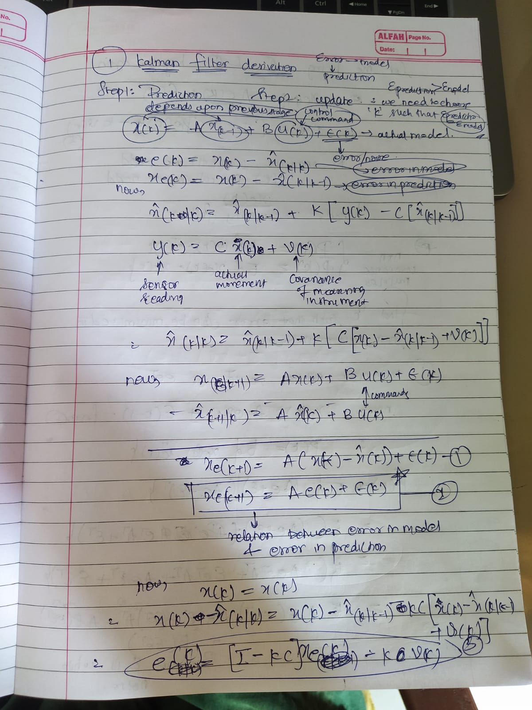
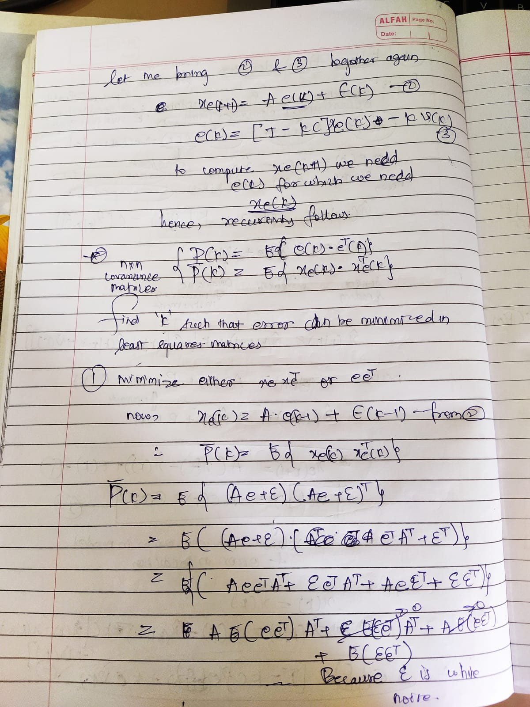
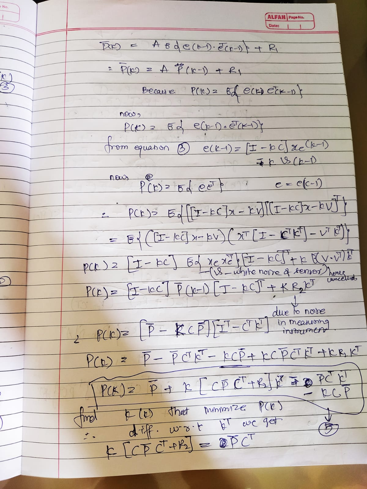
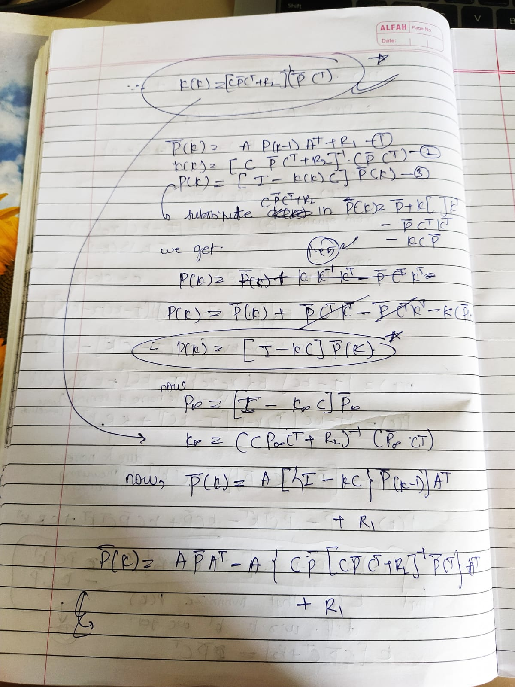
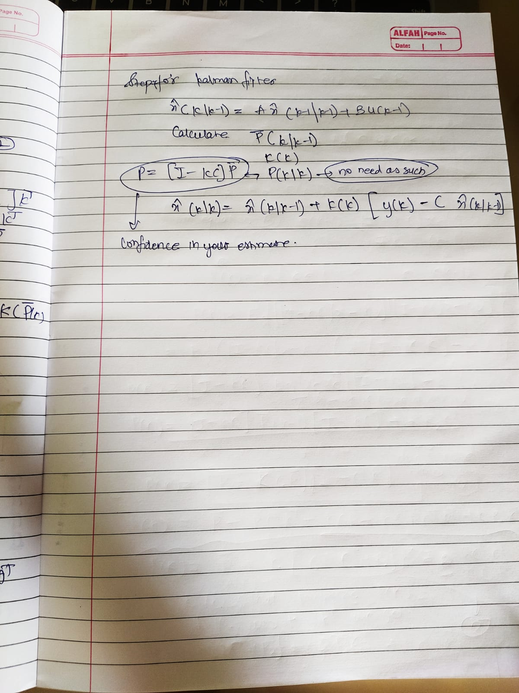

## Kalman filter 

Kalman Filter is widely used for state estimation of a system, when considered in real life.

There are two major steps in state estimation through kalman filter
1. Prediction - Here we utilize all the knowledge of the system through physical relations between the quantities. 

2. Update - Here we take into account how prediction and noise in the measurement affects the current estimate, and while doing so we find the **kalman gain** which minimizes the **prediction error**, thus giving us a better estimate of the current state.

